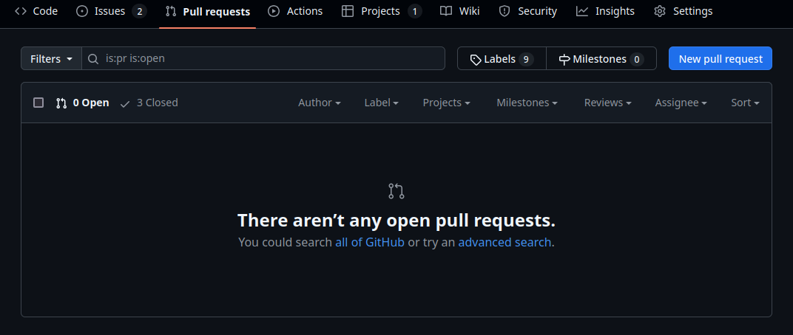
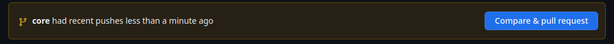
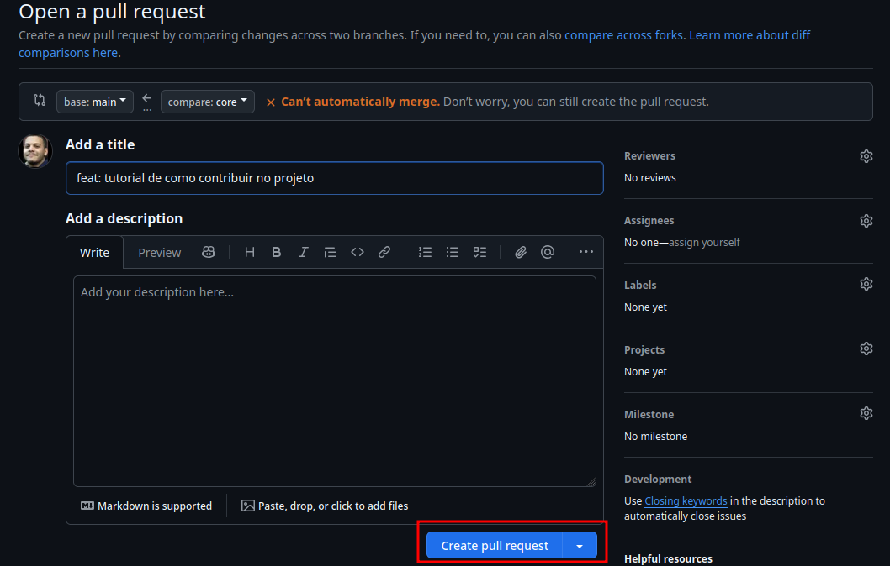

## The Game

Este repositório contém o projeto para o PI do 2 semestre

## Como contribuir com o projeto

#### Pré-requisitos
- Git
- Terminal (pode utilizar o do git bash)

#### 1. Clone o repositório utilizando git clone dentro de uma pasta de sua preferência
```
git clone https://github.com/OtavioSC/game.git
```

#### 2. Acesse o repositório clonado
```
cd game
```

#### 3. Altere para a branch que você realizará as modificações
```
git checkout -b feature/[nome-da-tarefa]

exemplo:

git checkout -b feature/acao-tela-inicial
```
#### 4. Valide a alteração de branch
```
git branch -v
```

A sua nova branch precisa estar selecionada

#### 5. Realize as modificações e verifique se as atualizações foram realizadas
```
git status
```

#### 6. Caso possua alterações em stage, adicione elas e crie um commit
```
git add *
git commit -m "adicionar imagem da tela inicial"
```

#### 7. Envie as alterações para o repositório
```
git push -u origin nome-da-branch

exemplo:

git push -u origin feature/acao-tela-inicial
```

#### 8. Crie a pull request
Caso você tenha enviado as modificações corretamente, vá até o repositório do projeto e clique na aba de `Pull requests` conforme a imagem



Clique em `Compare & pull request`



Finalize clicando em `Create pull request`




